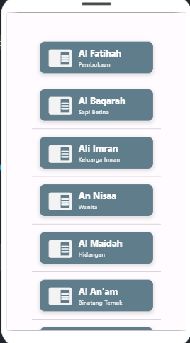

# uas-pemograman-mobile

# Aplikasi_Al-Quran_Api

## Tugas Akhir Semester

### Nama        : Muhammad Romdhom
### Nim         : 312010434
### Kelas       : TI.20.A.3
### Mata Kuliah : Pemrograman Mobile

#### Link Api
* https://github.com/Muhammadromdhon/uas-pemograman-mobile.git
* https://api.npoint.io/99c279bb173a6e28359c/data

#### Tampilan Aplikasi

